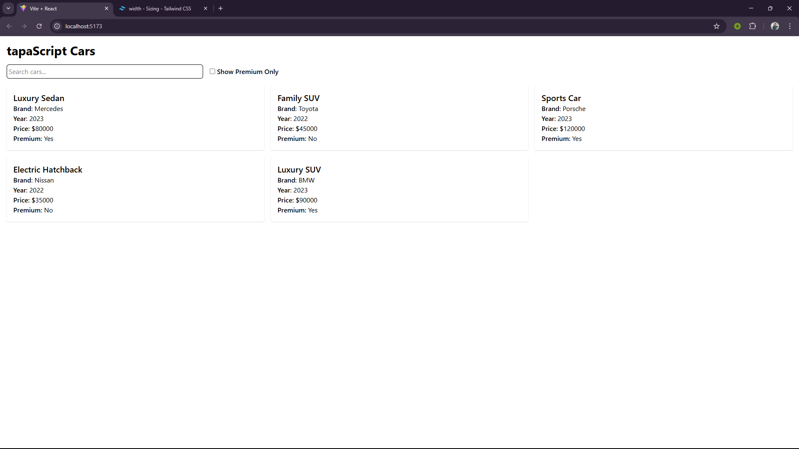
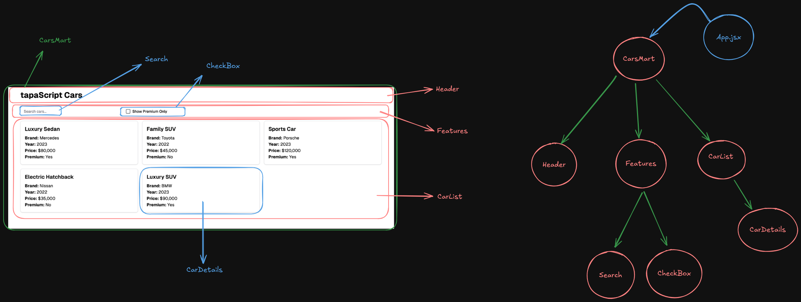
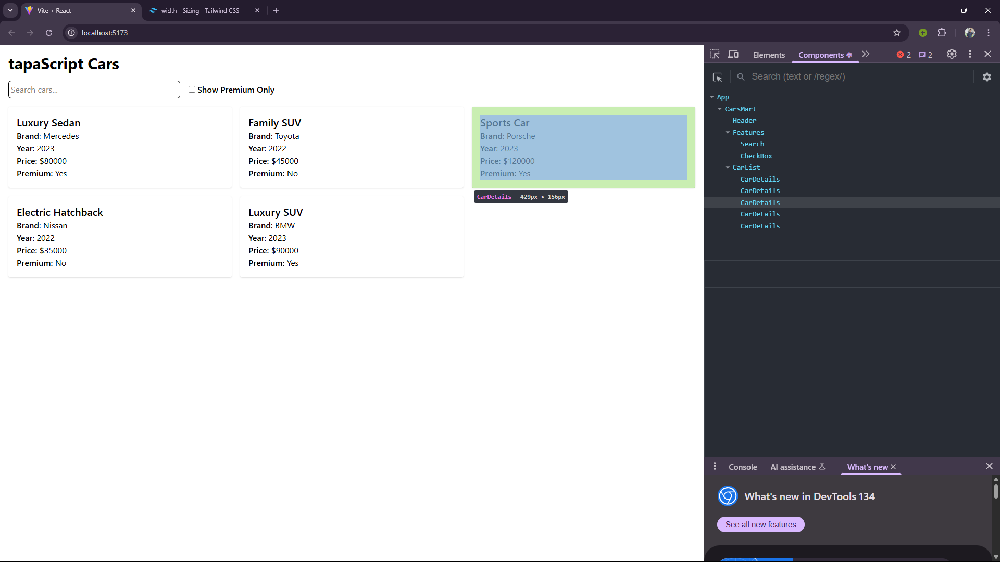

# CarsMart

CarsMart is a simple React application where users can search for cars and filter premium cars using a checkbox. The project is built with **React** and **TailwindCSS**.

## 📂 Features

- Search for cars by name
- Filter premium cars using a checkbox
- Styled using TailwindCSS
- No ESLint errors or suppressions
- No console errors

## 📦 Installation & Running the Project

To run this project locally, follow these steps:

1. Clone the repository:
   ```sh
   git clone https://github.com/jihad-islam/React-Car-Project.git
   ```
2. Navigate to the project directory:
   ```sh
   cd React-Car-Project
   ```
3. Install dependencies:
   ```sh
   yarn
   ```
4. Start the development server:
   ```sh
   yarn dev
   ```

## 📷 Screenshots

### UX Design Diagram



### Component Breakdown and Hierarchy Diagram



### React Dev Tools Screenshot



## 🚀 Live Demo

[Click here to visit the deployed app](#)  
(Replace `#` with the actual deployment link after deployment)

## 🛠 Tech Stack

- React
- TailwindCSS

## 🚀 Deployment

The project is deployed on **Netlify/Vercel/Render**.

[Click here to visit the deployed app](https://react-car-project-gamma.vercel.app/)  
(Replace `#` with the actual deployment link)

## 🔗 GitHub Repository

[GitHub Repository](https://github.com/jihad-islam/React-Car-Project.git)
